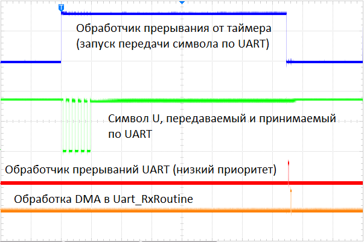

***
# Проверка прерываний UART STM32F103

Целью проекта является выяснить, происходит ли прерывание по приёму символа UART, если при этом принятые данные забираются из него по DMA.

## Методика проверки

0. Замыкаем предварительно перемычкой выводы RX и TX UART.
1. Инициализируем UART на скорости 1Мбит/с, разрешаем как запрос DMA от приёмника, так и прерывания от него же.
2. Инициализируем DMA, что бы складывать принятое UARTом в буфер.
3. Инициализируем таймер, что бы прерываться от него.

**В обработчике прерываний от таймера:**
- устанавливаем отладочную ножку 1 в сост. 1
- запускаем передачу одного символа по UART
- задерживаемся там же, пока таймер не досчитает до 3/4 интервала. За это время переданный символ попадаем обратно в приёмник, и DMA помещает его в буфер.
- устанавливаем отладочную ножку 1 в сост. 0

**В обработчике прерываний от UART:**
- устанавливаем отладочную ножку 2 в сост. 1
- фиксируем факт попадания в обработчик прерывания (увеличиваем счётчик)
- устанавливаем отладочную ножку 2 в сост. 0

**В основном цикле (main loop):**
- время от времени (постоянно) вызываем функцию, которая анализирует состояние канала DMA на предмет принятого символа (уменьшение счётчика CNDTR). Если есть факт приёма символа, дёргаем вверх-вниз отладочную ножку 3.

Состояние отладочных ножек и линии TX UART контролируем осциллографом.
Делаем 2 эксперимента:
- когда приоритет прерываний таймера выше приоритета прерываний UART
- наоборот

## Итоги проверки

1. Прерывания от UART происходят несмотря на то, что приянтый символ забран по DMA из приёмника
2. Поскольку в момент вызова обработчика прерывания UART его приёмник пуст, флаг статуса RXNE равен 0
3. Приоритет прерываний UART не влияет на факт вызова обработчика - он вызывается всегда

|  |
|:--:| 
| *Сигналы на отладочных выводах при низком приоритете прерываний UART* |

|  |
|:--:| 
|*Сигналы на отладочных выводах при высоком приоритете прерываний UART*|

